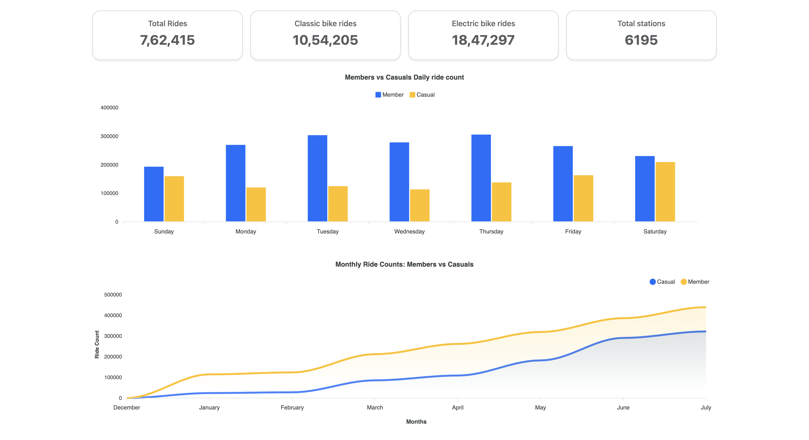
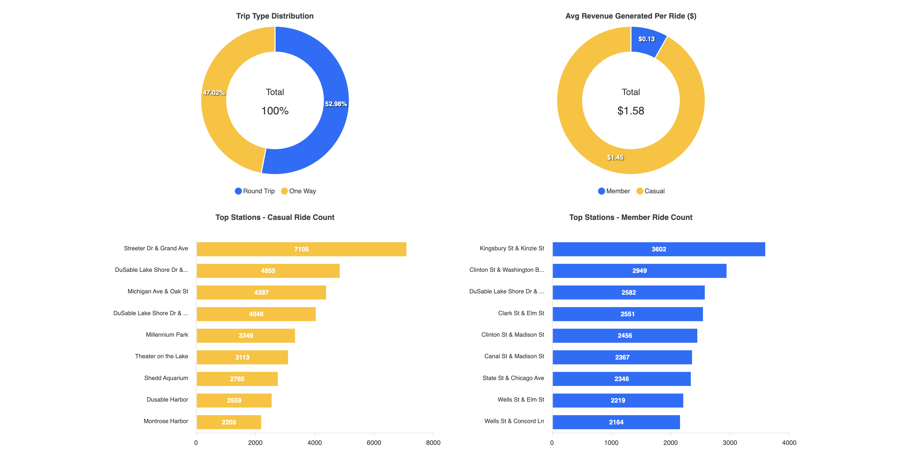

# 🚴 Cyclistic Bike-Share Case Study

This repository contains the analysis of the **Cyclistic bike-share dataset**.  
The goal of this project is to explore usage patterns of **Casual riders vs. Annual Members**, uncover insights into riding behavior, and identify opportunities to convert casual riders into members.

---

## 📊 Dashboard Design

The following dashboards were designed to visualize key metrics and insights from the dataset.

### 1️⃣ Overview Dashboard

**Insights:**
- **Total Rides:** `7,62,415` rides recorded in the dataset.  
- **Classic Bike Rides:** `10,54,205` vs. **Electric Bike Rides:** `18,47,297` → Electric bikes are more popular among users.  
- **Total Stations:** `6,195` active stations across the network.  

#### Members vs. Casual Daily Ride Count
- Members consistently take more weekday rides, peaking on **Tuesdays and Thursdays**.  
- Casual riders ride more during weekends, especially on **Saturdays and Sundays**, indicating leisure-based usage.  

#### Monthly Ride Counts (December → July)
- Members maintain a steady upward growth trend.  
- Casual rides rise more significantly from **May to July**, likely influenced by better weather and tourism.

---

### 2️⃣ Trip Type, Revenue, and Top Stations

 

**Insights:**
- **Trip Type Distribution:**  
  - **Round Trips:** 52.98%  
  - **One Way Trips:** 47.02%  
  - Round trips are slightly more common, showing casual leisure usage patterns.  

- **Average Revenue per Ride:**  
  - Casual Riders: `$1.45`  
  - Members: `$0.13`  
  - Casual users contribute significantly higher revenue per ride, but members ride more frequently overall.  

- **Top Stations – Casual Riders:**  
  - Popular locations include **Streeter Dr & Grand Ave (7,105 rides)**, **Lake Shore Drive stations**, and **Millennium Park**.  
  - These stations are tourist-heavy, reinforcing that casual riders are often visitors.  

- **Top Stations – Members:**  
  - Frequently used stations include **Kingsbury St & Kinzie St (3,602 rides)**, **Clinton St**, and **State St**.  
  - These are mostly **commuter-heavy stations**, showing members use the service for daily work commutes.

---

## 📝 Key Takeaways
- **Casual vs Member Behavior:** Casual riders ride mostly on weekends & at tourist attractions, while members ride on weekdays for commutes.  
- **Revenue Potential:** Casual riders generate more revenue per trip, but sustained engagement through memberships ensures long-term retention.  
- **Growth Opportunity:** Cyclistic can focus on converting casual riders (especially weekend users and tourists) into members by offering seasonal/short-term membership packages.

---

## 📂 Repository Contents
- Data Cleaning & Transformation Scripts  
- Exploratory Data Analysis (EDA)  
- Visualization Notebooks  
- Dashboard Design Screenshots  

---

## ⚙️ Tools Used
- **Python (Pandas, Matplotlib, Seaborn)** for data wrangling and analysis  
- **SQL** for querying large datasets  
- **Tableau / Power BI** for visualization and dashboard design  
- **Excel** for quick data exploration

---

## 🚀 How to Reproduce This Analysis
1. Download the Cyclistic bike-share dataset from [Kaggle / Google Data Analytics Capstone Dataset](https://divvy-tripdata.s3.amazonaws.com/index.html).  
2. Run the preprocessing scripts in the `notebooks/` folder.  
3. Open the visualization dashboards in Tableau / Power BI to explore insights.  
4. View the final dashboards included in this repository (`dashboard1.png` and `dashboard2.png`).  

---

✍️ **Author:** Vivek Jangam  
🔗 Connect with me on [LinkedIn](https://www.linkedin.com)  

